# GAPA - Appointment Reservation System

> Web system for managing client appointments for the accounting company GAPA

[Live Demo](https://gapa.infinityfreeapp.com)

---

## Table of Contents

- [About The Project](#about-the-project)
- [Built With](#built-with)
- [Project Structure](#project-structure)
- [Features](#features)
- [Deployment](#deployment)
- [Contact](#contact)

---

## About The Project

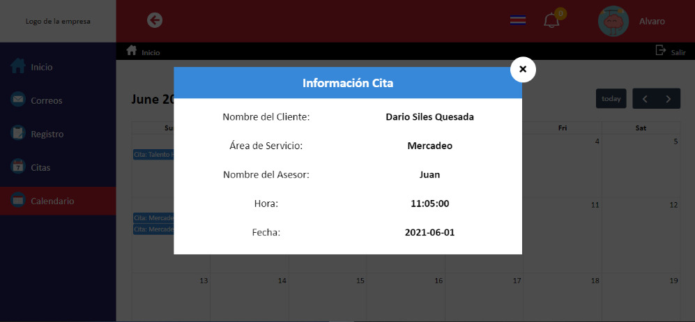

This project was developed as a graduation project for the Web Design and Development technician program. The goal was to create a digital solution for the accounting company GAPA to manage client appointments more efficiently, replacing manual scheduling processes with an organized and automated system.

### Why This Project?

- Replace **manual appointment scheduling** with a digital system
- Improve **client-company communication** through automated notifications
- Learn **full-stack web development** with PHP and MySQL
- Implement **user authentication** and role-based access control
- Build a **real-world solution** for an actual business need

**Note:** This system was developed to solve real operational needs of GAPA accounting company, streamlining their appointment management process.

---

## 🛠 Built With

- **HTML5** - Page structure and semantic markup
- **CSS3** - Styling and responsive design
- **JavaScript (ES6+)** - Client-side interactions and validations
- **PHP** - Server-side logic and session management
- **MySQL** - Database for users, appointments, and notifications
- **PHPMailer** - Email notifications and password recovery
- **FullCalendar** - Interactive calendar for appointment visualization

---

## Project Structure

This project follows a modular structure with clear separation of concerns.

```
SRCG/
│
├── ui/                      # User interface (Views)
│   ├── login/               # Login, password recovery, registration
│   ├── inicio/              # Dashboard and home page
│   ├── calendario/          # Appointment calendar
│   ├── perfil/              # User profile management
│   ├── rce/                 # Appointment administration (employees)
│   ├── rcc/                 # Appointment booking (clients)
│   ├── correos/             # Mass email system
│   └── analitica_web/       # Web analytics
│
├── negocios/                # Business logic
│   ├── n_citas/             # Appointment management
│   ├── n_usuarios/          # User management
│   ├── n_perfil/            # Profile operations
│   ├── n_correos/           # Email handling
│   └── n_notificacion/      # Notification system
│
├── data/                    # Data access layer
│   ├── data_citas.php       # Appointment queries
│   ├── data_usuarios.php    # User queries
│   ├── data_perfil.php      # Profile data
│   └── data_notificacion.php
│
├── db/                      # Database connection
│   └── db_access.php        # Auto-detect environment config
│
├── sesion/                  # Session management
│   └── C_Sesion.php         # Session controller
│
├── assets/                  # Static resources
│   ├── css/                 # Stylesheets
│   ├── js/                  # JavaScript files
│   ├── img/                 # Images and icons
│   ├── PHPMAILER/           # Email library
│   └── fullcalendar/        # Calendar library
│
├── config_email.php         # Email configuration (local/production)
└── srcg.sql                 # Database schema and initial data
```

---

## Features

### Login System

Secure authentication with session management and role-based access control.

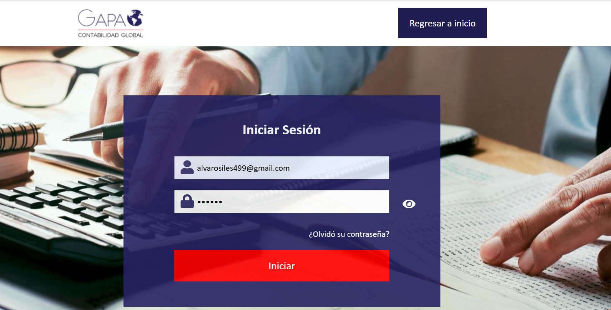

---

### Password Recovery

Users can recover their password via email with temporary credentials.


---

### User Registration

Registration system for both employees and clients with email verification.


**Registration Features:**
- Form validation
- Email verification
- Automatic password generation
- Role assignment (Employee/Client)
- Welcome email with credentials

  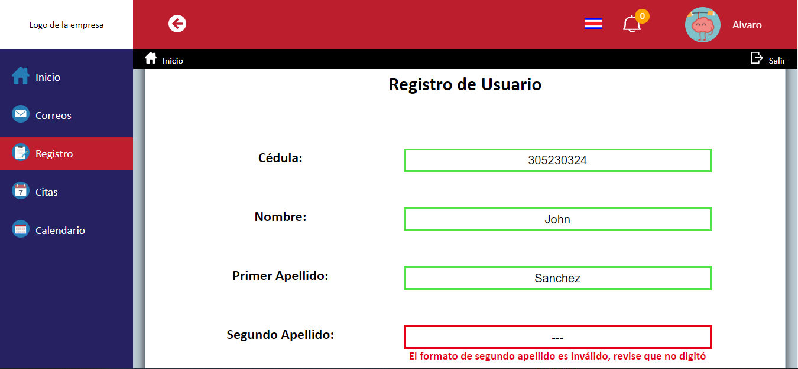    
   
    
  *Creación exitosa de usuario
  
  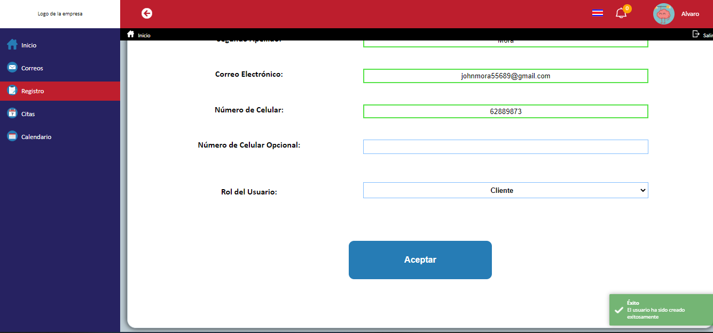

---

### Appointment Reservation System

Complete appointment management with calendar view and status tracking.


**Appointment Features:**
- Interactive calendar with FullCalendar
- Available time slots
- Appointment request/approval workflow
- Email notifications on status changes
- Appointment history
- Cancel/reschedule functionality

   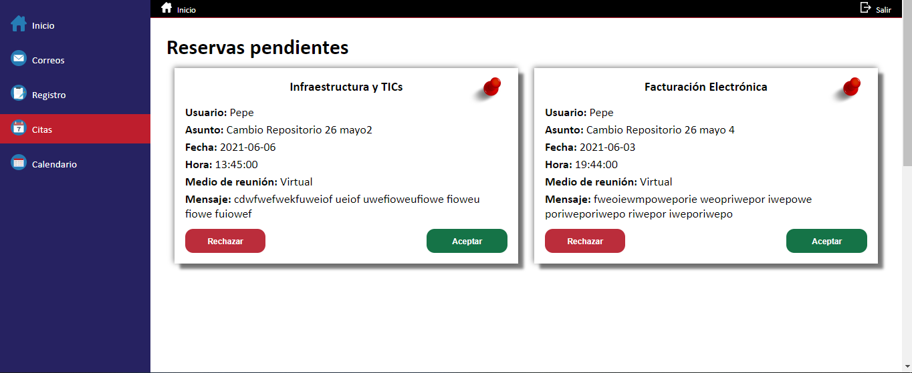

---

### Notification System

Real-time notification system for appointment updates and system messages.

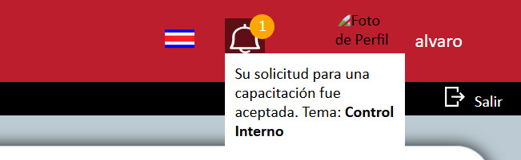

**Notification Features:**
- Badge counter for unread notifications
- Mark as read/unread
- Delete notifications
- Auto-refresh
- Categorized by type

---

### Mass Email Sending

Send emails to all clients or specific groups with file attachments.

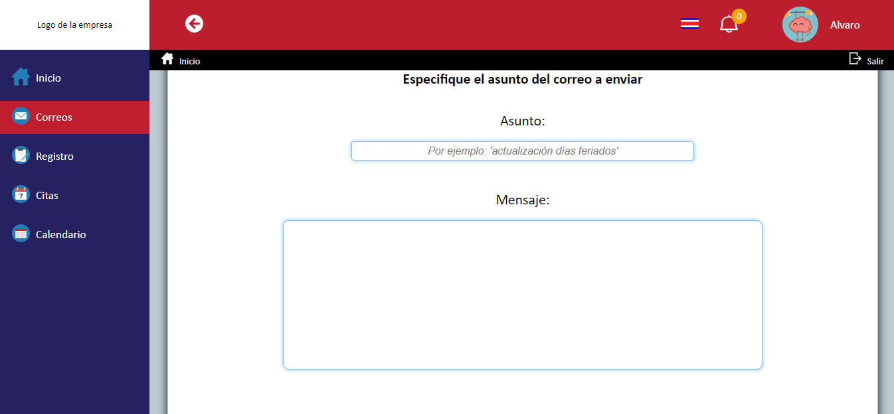

**Email Features:**
- Rich text editor
- File attachments support (up to 5 images)
- Recipient selection (all clients or specific)
- Email templates
- Delivery tracking

   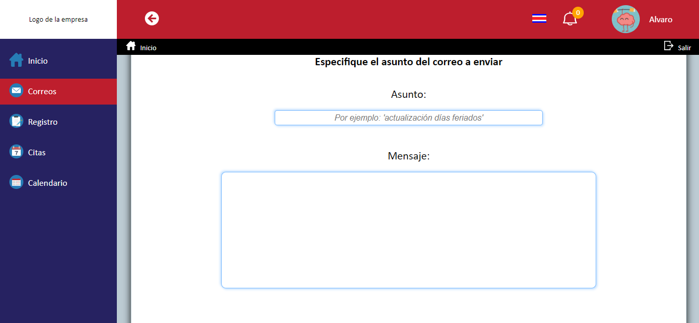    
   
    *Envío de correos
    
   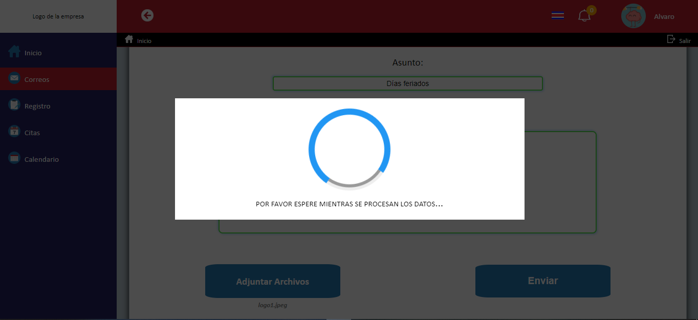

---

### Personal Information Overview

View and edit user profile information with profile picture upload.

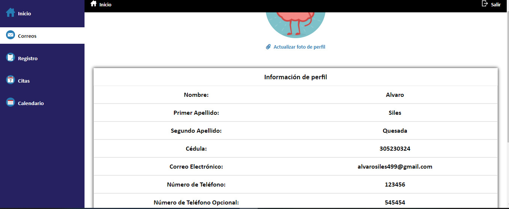

**Profile Features:**
- Profile picture upload and crop
- Personal information editing
- Password change
- Activity history
- Account settings

---

### Appointments Dashboard

Centralized dashboard showing appointment statistics and quick actions.


**Dashboard Features:**
- Pending appointments count
- Recent notifications
- Quick navigation menu
- User role-specific views

---

### Calendar View

Interactive calendar displaying all appointments with detailed information.

   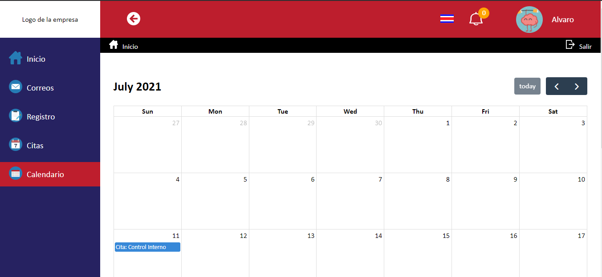
   
   El calendario tambien tiene una opcion de ver información detallada, al presionar sobre la cita se desplegará un modal con la información completa de la cita.
   
   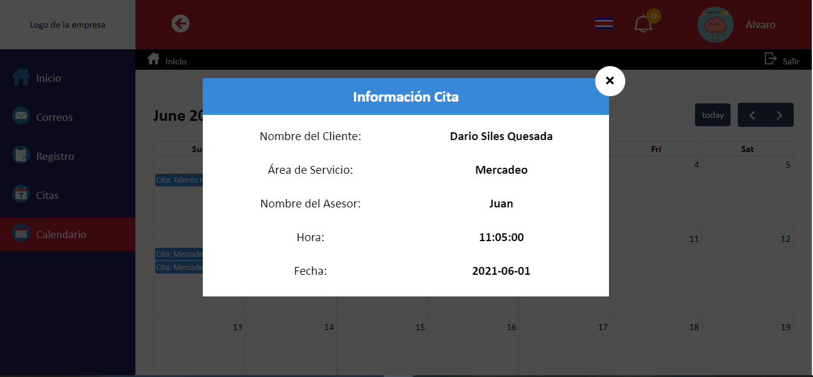

---

### Multi-language Support

The system is adapted to two languages: Spanish and English.

   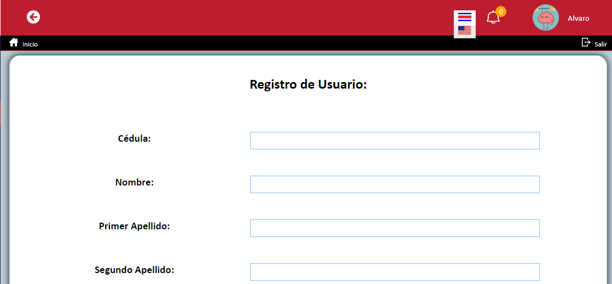
      
   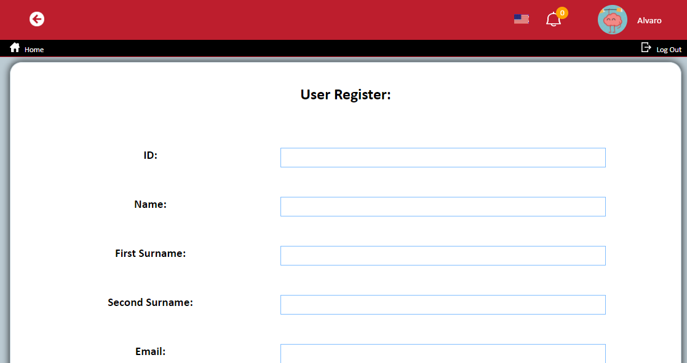

---

### Responsive Design

Optimized for desktop, tablet, and mobile devices with accessible navigation.

   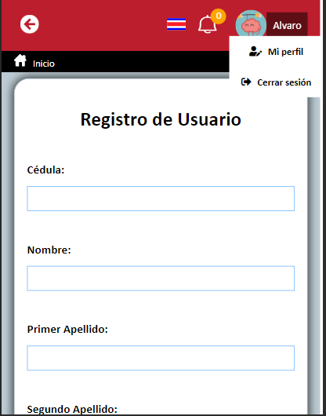
      
   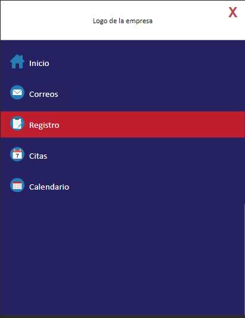

[(back to top)](#gapa---appointment-reservation-system)

---

## Contact

**Alvaro Siles**

- GitHub: [@Alvaro499](https://github.com/Alvaro499)
- Email: alvarosiles499@gmail.com
- Project Repository: [https://github.com/Alvaro499/Sistema-de-Reserva-de-Citas.git](https://github.com/Alvaro499/Sistema-de-Reserva-de-Citas.git)

[(back to top)](#gapa---appointment-reservation-system)

---